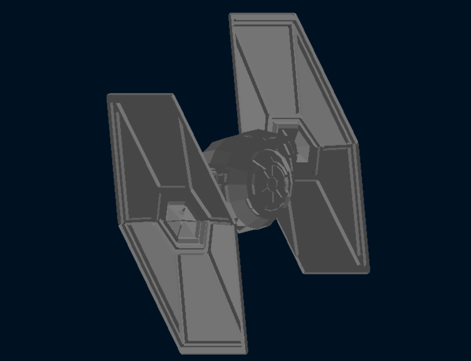

# Renderizador 3D de Modelos OBJ en Rust

Motor de renderizado 3D por software desarrollado en Rust que permite visualizar archivos Wavefront OBJ mediante rasterización de triángulos, con soporte para transformaciones espaciales e iluminación dinámica.

## ✨ Funcionalidades Principales

- **Importación de archivos OBJ**: Procesamiento completo de geometría en formato Wavefront
- **Renderizado basado en triángulos**: Algoritmo de rasterización implementado con coordenadas baricéntricas
- **Manipulación espacial 3D**: Movimiento, rotación y ajuste de escala en tiempo real
- **Buffer de profundidad**: Algoritmo Z-Buffer para resolución de oclusión geométrica
- **Sistema de iluminación**: Motor de iluminación con luz ambiente y difusa
- **Interacción por mouse y teclado**: Control completo de cámara y transformaciones

## 🛠️ Stack Tecnológico

- **Rust** - Lenguaje de sistemas para alto rendimiento
- **nalgebra-glm** - Librería de álgebra lineal para gráficos 3D
- **minifb** - Framework para gestión de ventanas y buffer de píxeles
- **tobj** - Parser de archivos de geometría OBJ
- **image** - Procesamiento y exportación de imágenes

## 📋 Prerrequisitos

- Rust 1.70 o versión posterior
- Modelo 3D `CazaTie.obj` ubicado en el directorio `assets/`

## 🚀 Inicio Rápido

```bash
# Clonar este repositorio
git clone https://github.com/Nery2004/Carga-de-modelos.git
cd Carga-de-modelos

# Compilar y lanzar en modo optimizado
cargo run --release
```

## 🎮 Controles de Usuario

### Teclado
| Control | Función |
|---------|---------|
| `Flechas` | Desplazar modelo en pantalla |
| `A / S` | Reducir / Aumentar escala |
| `Q / W` | Rotación en eje X (pitch) |
| `E / R` | Rotación en eje Y (yaw) |
| `T / Y` | Rotación en eje Z (roll) |
| `ESC` | Cerrar aplicación |

### Mouse
| Control | Función |
|---------|---------|
| `Botón izquierdo + Arrastrar` | Rotar modelo libremente |

## 📁 Arquitectura del Proyecto

```
Carga-de-modelos/
├── Cargo.toml              # Configuración de dependencias
├── assets/
│   └── CazaTie.obj         # Archivo de geometría 3D
└── src/
    ├── main.rs             # Ciclo principal de renderizado
    ├── obj.rs              # Parser de archivos OBJ
    ├── vertex.rs           # Definición de vértices
    ├── triangle.rs         # Motor de rasterización
    ├── shaders.rs          # Transformaciones de vértices
    ├── framebuffer.rs      # Gestión de buffers de imagen
    ├── fragment.rs         # Procesamiento de píxeles
    ├── color.rs            # Manejo de colores RGB
    └── line.rs             # Algoritmo de líneas
```

## 🔄 Flujo de Renderizado

El proceso de renderizado sigue estas etapas:

1. **Importación**: Lectura del archivo OBJ y construcción de malla de vértices
2. **Transformación de vértices**: Aplicación de matrices de modelo-vista-proyección
3. **Ensamblado de primitivas**: Construcción de triángulos a partir de índices
4. **Rasterización**: Conversión de geometría vectorial a píxeles discretos
5. **Sombreado de fragmentos**: Cálculo de color final con iluminación
6. **Test de profundidad**: Resolución de visibilidad mediante Z-Buffer

## 💡 Detalles de Implementación

### Procesamiento de Geometría
```rust
// Iteración sobre cada triángulo de la malla
for triangle_idx in (0..indices.len()).step_by(3) {
    let i1 = indices[triangle_idx] as usize;
    let i2 = indices[triangle_idx + 1] as usize; 
    let i3 = indices[triangle_idx + 2] as usize;
    
    // Extraer vértices transformados
    let v1 = &transformed_vertices[i1];
    let v2 = &transformed_vertices[i2];
    let v3 = &transformed_vertices[i3];
    
    // Generar fragmentos rasterizados
    let fragments = triangle(v1, v2, v3);
}
```

### Algoritmo de Rasterización
- **Delimitación espacial**: Cálculo de bounding box para optimizar procesamiento
- **Test de inclusión**: Uso de coordenadas baricéntricas para determinar cobertura de píxeles
- **Interpolación de atributos**: Suavizado de propiedades geométricas entre vértices

### Modelo de Iluminación
- **Componente ambiental**: Iluminación base uniforme (50%)
- **Componente difusa**: Cálculo mediante producto escalar de normales y dirección de luz
- **Resultado final**: Combinación ponderada para iluminación equilibrada

## 🎨 Configuración Visual

- **Entorno de fondo**: Tono azul espacial (#001122)
- **Material del modelo**: Gris medio con respuesta de iluminación realista
- **Modelo de sombreado**: Mezcla de luz ambiente y difusa para apariencia uniforme
- **Sensibilidad de mouse**: Factor de 0.005 para rotación suave

## 📸 Galería Visual




